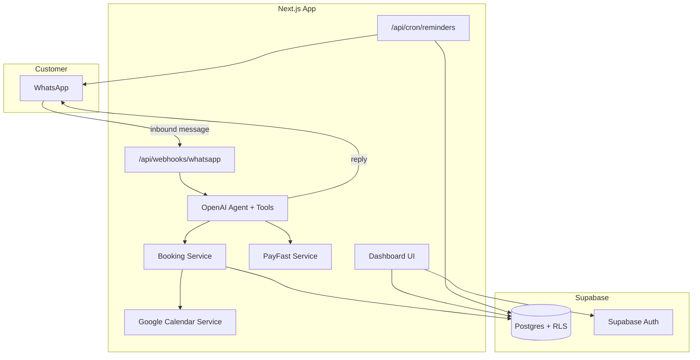
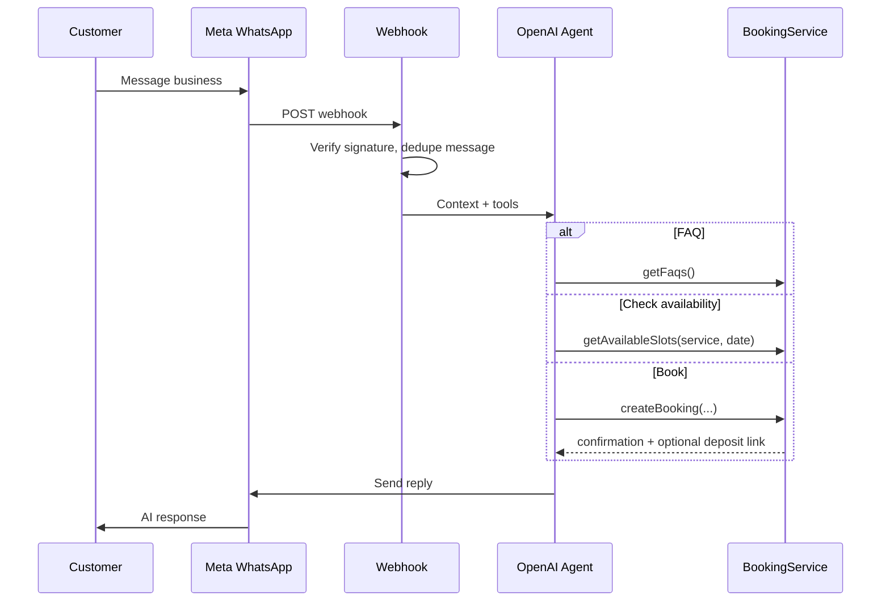

# AI WhatsApp Receptionist & Booking Platform — Full MVP Plan

> **Companion doc:** See [`context.md`](../context.md) for product vision, principles, and scope boundaries. This file covers *how* we build the MVP.

## Current State

The workspace has reference docs (`context.md`, `docs/PLAN.md`). Git and GitHub are not set up yet.

Product spec lives in [`context.md`](../context.md).

Sibling project [`Be My Dev`](../../Be%20My%20Dev) already uses **Next.js + Supabase + Meta WhatsApp Cloud API** — reuse those conventions (Zod validation, server-only env vars, `Africa/Johannesburg` timezone, Graph API v21.0).

---

## Architecture (MVP)

Single **Next.js 15 monolith** (App Router): dashboard UI + API routes + webhooks. No microservices.



**Multi-tenancy:** every row scoped by `business_id`. Supabase Row Level Security (RLS) ensures owners only see their data.

**Timezone:** store UTC in DB; display and slot logic in `Africa/Johannesburg`.

---

## Tech Stack

| Layer | Choice | Why |
|-------|--------|-----|
| Frontend | Next.js 15, React 19, Tailwind 4, shadcn/ui | Mobile-first dashboard; matches Be My Dev |
| Backend | Next.js Route Handlers | API-first without extra infra |
| Database | Supabase Postgres + RLS | Auth + DB in one; fast MVP |
| Auth | Supabase Auth (email magic link) | Fast signup, no password friction |
| WhatsApp | Meta Cloud API | Already proven in Be My Dev |
| AI | OpenAI GPT-4o + tool calling | Reliable structured actions (book/cancel/reschedule) |
| Payments | PayFast | Standard for SA SMEs; deposit links |
| Calendar | Google Calendar API (OAuth) | Covers ~80% of target businesses |
| Jobs | Vercel Cron (or Supabase pg_cron) | Reminders + follow-ups |
| Validation | Zod | Consistent with Be My Dev |

---

## Database Schema (Core Tables)

All in `supabase/migrations/001_initial.sql`:

- **businesses** — name, phone, timezone, currency (ZAR), onboarding_step, is_live
- **profiles** — links `auth.users` → `business_id`, role (`owner`)
- **services** — name, duration_minutes, price_cents, deposit_cents (nullable), active
- **business_hours** — day_of_week, open_time, close_time (simple weekly schedule for MVP)
- **customers** — whatsapp_phone (unique per business), name
- **conversations** — customer_id, status, last_message_at
- **messages** — conversation_id, direction (in/out), body, wa_message_id
- **bookings** — service_id, customer_id, starts_at, ends_at, status (`pending`, `confirmed`, `cancelled`, `completed`), google_event_id
- **faqs** — question, answer, sort_order
- **payments** — booking_id, payfast_payment_id, amount_cents, status, payment_url
- **integrations** — type (`whatsapp`, `google_calendar`, `payfast`), encrypted tokens/settings JSON
- **scheduled_jobs** — type (`reminder`, `follow_up`), booking_id, run_at, sent_at

**Availability logic (MVP-simple):** generate slots from `business_hours` minus existing `bookings` for the requested service duration. No staff scheduling, no complex buffers (Phase 2).

---

## Customer WhatsApp Flow



**AI guardrails (from spec):**

- System prompt includes only business-provided FAQs, services, hours — never invent prices or availability
- Tool calls are the source of truth for booking actions (AI does not "pretend" to book)
- Escalation: if confidence low or customer asks for human → notify owner via WhatsApp template + flag conversation

**Key files:**

- `src/lib/ai/agent.ts` — orchestration + tool definitions
- `src/lib/ai/tools.ts` — `getFaqs`, `getAvailableSlots`, `createBooking`, `rescheduleBooking`, `cancelBooking`, `createDepositLink`
- `src/lib/services/whatsapp.ts` — send/receive (extend Be My Dev pattern)
- `src/app/api/webhooks/whatsapp/route.ts` — verify + ingest

---

## Business Owner Journey (< 10 min target)

Linear onboarding wizard at `src/app/onboarding/`:

1. **Sign up** — Supabase magic link
2. **Business details** — name, category, phone
3. **Services** — add 1–3 services (name, duration, price, optional deposit)
4. **Hours** — simple Mon–Sun toggles + open/close
5. **Calendar** — Google OAuth connect (optional skip with warning)
6. **WhatsApp** — enter WABA phone number ID + access token (guided setup doc); verify with test message
7. **Payments** — PayFast merchant ID + key (optional; required only if deposits enabled)
8. **Go live** — flip `businesses.is_live = true`

Post-onboarding: redirect to dashboard. Allow editing all settings from `src/app/dashboard/settings/`.

---

## Dashboard (MVP screens)

Mobile-responsive, minimal clutter per spec:

| Screen | Path | Shows |
|--------|------|-------|
| Home | `/dashboard` | Today's bookings, new enquiries, revenue (month), unpaid deposits, upcoming |
| Calendar | `/dashboard/calendar` | Week/day view of bookings |
| Customers | `/dashboard/customers` | WhatsApp contacts + booking history |
| Services | `/dashboard/services` | CRUD services + deposits |
| Availability | `/dashboard/availability` | Weekly hours editor |
| Payments | `/dashboard/payments` | Deposit status list |
| Reports | `/dashboard/reports` | Bookings count, conversion, revenue (basic) |

Shared layout: `src/app/dashboard/layout.tsx` with bottom nav on mobile.

---

## Integrations Detail

### WhatsApp (Meta Cloud API)

- Webhook: `GET` verification + `POST` message events
- Store `WHATSAPP_VERIFY_TOKEN`, per-business `phone_number_id` + token in `integrations`
- Idempotency via `wa_message_id` unique constraint
- Outbound: text messages for MVP (templates for reminders only)

### PayFast (deposits)

- `src/lib/services/payfast.ts` — generate signed payment URL
- ITN webhook at `src/app/api/webhooks/payfast/route.ts` — confirm payment → update booking status
- AI sends deposit link when service has `deposit_cents > 0`

### Google Calendar

- OAuth flow at `src/app/api/integrations/google/callback/route.ts`
- On booking create/update/cancel → sync event to connected calendar
- Store refresh token encrypted in `integrations`

### Reminders & Follow-ups

- Cron job `src/app/api/cron/reminders/route.ts` (daily/hourly)
- 24h before appointment: WhatsApp reminder
- After completed appointment: follow-up message (simple template)
- Uses `scheduled_jobs` table to avoid duplicate sends

---

## Project Structure

```
/
├── context.md
├── docs/
│   └── PLAN.md
├── .env.example
├── package.json
├── supabase/
│   └── migrations/
├── src/
│   ├── app/
│   │   ├── (auth)/login/
│   │   ├── onboarding/
│   │   ├── dashboard/
│   │   └── api/
│   │       ├── webhooks/whatsapp/
│   │       ├── webhooks/payfast/
│   │       ├── cron/reminders/
│   │       └── integrations/google/
│   ├── components/
│   ├── lib/
│   │   ├── supabase/
│   │   ├── ai/
│   │   ├── services/   (booking, whatsapp, payfast, calendar)
│   │   └── validation/
│   └── types/
└── README.md
```

---

## Environment Variables (`.env.example`)

```
NEXT_PUBLIC_SUPABASE_URL=
NEXT_PUBLIC_SUPABASE_ANON_KEY=
SUPABASE_SERVICE_ROLE_KEY=

OPENAI_API_KEY=

WHATSAPP_VERIFY_TOKEN=
# Per-business tokens stored in DB after onboarding

GOOGLE_CLIENT_ID=
GOOGLE_CLIENT_SECRET=
GOOGLE_REDIRECT_URI=

PAYFAST_MERCHANT_ID=
PAYFAST_MERCHANT_KEY=
PAYFAST_PASSPHRASE=
PAYFAST_SANDBOX=true

CRON_SECRET=
NEXT_PUBLIC_APP_URL=
```

---

## Implementation Order

Build in dependency order — each step is testable before moving on.

### Sprint 1 — Foundation (Days 1–2)

- Init git + create GitHub repo `Harley2626/AI-WhatsApp-Receptionist-Booking-Platform` and push initial commit
- Init Next.js + Tailwind + shadcn/ui
- Add `README.md`, `.env.example` (reference docs already in repo)
- Supabase project + full migration + RLS policies
- Auth (login) + profile bootstrap on first sign-in

### Sprint 2 — Business Core (Days 3–4)

- Onboarding wizard (steps 1–4: business, services, hours)
- Booking service: slot generation, create/read/update/cancel
- Internal calendar view (no Google yet)

### Sprint 3 — WhatsApp + AI (Days 5–7)

- WhatsApp webhook + outbound messaging
- Conversation persistence
- OpenAI agent with booking tools
- FAQ answering from DB
- End-to-end: message → book → confirmation

### Sprint 4 — Integrations (Days 8–10)

- Google Calendar OAuth + sync
- PayFast deposit links + ITN webhook
- Onboarding steps 5–8 (calendar, WhatsApp, payments, go live)

### Sprint 5 — Dashboard + Automation (Days 11–13)

- Dashboard home + all MVP screens
- Basic reports queries
- Cron reminders + follow-ups
- Human escalation notifications to owner

### Sprint 6 — Hardening (Days 14–15)

- Error handling, webhook retries, rate limits
- Mobile QA on dashboard
- Sandbox testing checklist (WhatsApp test number, PayFast sandbox)

---

## Explicit Non-Goals (Phase 2+)

Per spec — do **not** build in this MVP:

- Staff scheduling, multi-location, inventory
- Loyalty, reviews, advanced analytics
- Custom workflow builder, public API
- Complex accounting / ERP features

---

## GitHub Repository

| Item | Value |
|------|-------|
| Account | [`Harley2626`](https://github.com/Harley2626) |
| Display name | AI WhatsApp Receptionist & Booking Platform |
| Repo slug | `AI-WhatsApp-Receptionist-Booking-Platform` |
| Remote URL | `https://github.com/Harley2626/AI-WhatsApp-Receptionist-Booking-Platform.git` |

GitHub repo names cannot contain spaces or `&`, so the slug uses hyphens while keeping the full product name in the repo description and README.

### Setup steps (Sprint 1 — before or alongside Next.js scaffold)

1. Add `.gitignore` (Node/Next.js, `.env*`, OS files)
2. `git init` in the project root
3. Initial commit: `context.md`, `docs/PLAN.md`, `README.md`, `.gitignore`
4. Create remote repo via GitHub CLI:
   ```bash
   gh repo create Harley2626/AI-WhatsApp-Receptionist-Booking-Platform \
     --public \
     --description "AI WhatsApp receptionist and booking platform for South African service businesses" \
     --source=. \
     --remote=origin \
     --push
   ```
5. Verify: `git remote -v` and repo visible at `https://github.com/Harley2626/AI-WhatsApp-Receptionist-Booking-Platform`

**Requires:** GitHub CLI (`gh`) authenticated as `Harley2626`. Never commit `.env`, secrets, or service-role keys.

---

## Deployment

- **App:** Vercel (Next.js native; cron support)
- **DB/Auth:** Supabase hosted
- **Webhooks:** Public HTTPS URLs (`NEXT_PUBLIC_APP_URL`)
- Meta WhatsApp webhook URL → `/api/webhooks/whatsapp`
- PayFast ITN URL → `/api/webhooks/payfast`

---

## Success Criteria for MVP Launch

- Business owner completes onboarding in under 10 minutes
- Customer can book entirely via WhatsApp without human intervention
- Reschedule and cancel work via WhatsApp
- Deposit link sent and payment status reflected in dashboard
- Google Calendar event created on booking
- Reminder sent 24h before appointment
- Dashboard shows today's bookings, revenue, and unpaid deposits
- AI never returns fabricated business info (only DB-backed answers)

---

## Implementation Checklist

- [x] Initialize git, `.gitignore`, GitHub repo (`Harley2626/AI-WhatsApp-Receptionist-Booking-Platform`), push initial commit
- [x] Initialize Next.js project (v16, App Router), README, .env.example, Tailwind + hand-rolled UI kit
- [x] Create Supabase migrations: all core tables, RLS policies, indexes, overlap-safe booking constraint
- [x] Implement Supabase Auth (magic link) + 6-step onboarding wizard (business, services, hours, calendar, WhatsApp, payments) + go-live
- [x] Build booking service: slot generation, CRUD, availability from business_hours, double-booking protection
- [x] Meta WhatsApp webhook + outbound messaging + conversation/message persistence
- [x] OpenAI agent with tools for FAQ, availability, book/reschedule/cancel, deposit link, escalation
- [x] PayFast deposit link generation + ITN webhook + payment status in dashboard
- [x] Google Calendar OAuth + booking sync on create/update/cancel
- [x] Mobile-first dashboard: home, calendar, customers, services, availability, payments, reports, settings
- [x] Cron job for 24h reminders and post-appointment follow-ups (`vercel.json` + `/api/cron/reminders`)
- [ ] Webhook idempotency hardening under load, end-to-end sandbox test pass (WhatsApp test number + PayFast sandbox), deploy to Vercel + Supabase

### Notes on deviations from the original plan

- Used **Next.js 16** (latest stable at build time) instead of 15 — App Router API is compatible; `middleware.ts` was written as `proxy.ts` per Next 16's rename.
- Skipped the shadcn/ui CLI in favor of a small hand-rolled Tailwind component kit (`src/components/ui`) to avoid interactive-prompt friction in this environment — same visual outcome, fewer dependencies.
- Product was named **"Yebo"** for a friendlier, South African-flavoured WhatsApp persona (customers chat with "Yebo", not a generic bot).
- No in-dashboard reply/inbox feature was built for escalated conversations — the WhatsApp number is the business's real Meta number, so owners can reply directly from the WhatsApp Business app when a conversation is flagged "escalated" in the dashboard. A full support inbox was judged out of scope for the MVP per the non-goals list.
- The project folder itself contains an `&`, which breaks Windows `cmd.exe`-based tooling (`npm`/`next` scripts). Worked around locally with a directory junction at `C:\Development\AI-WhatsApp-Receptionist-Booking-Platform`; recommend renaming the real folder (removing the `&`) next time the workspace is reopened.
